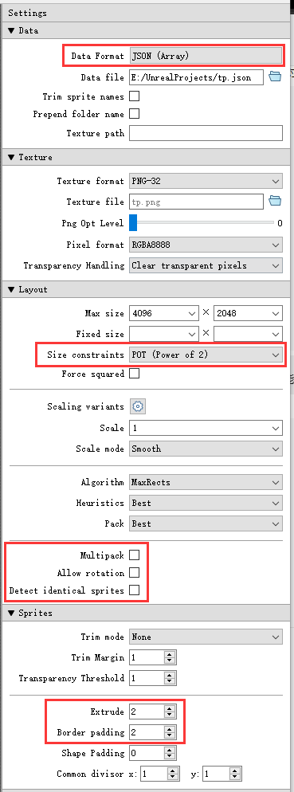
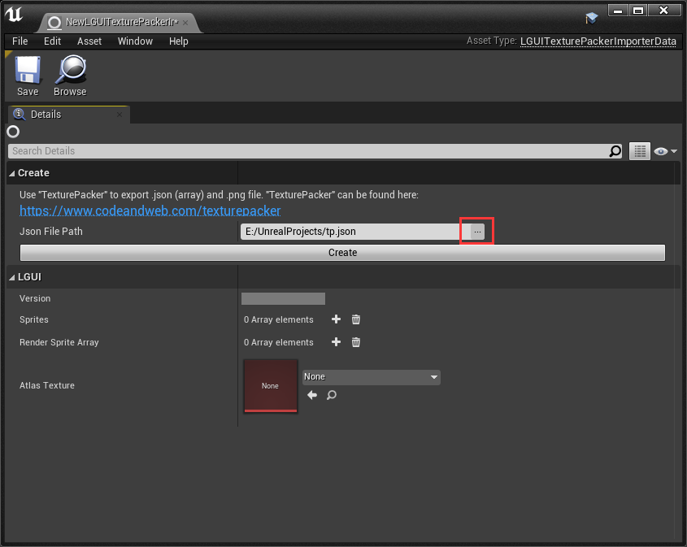
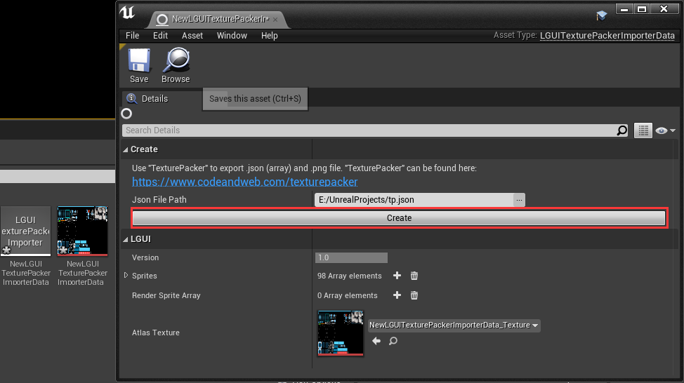
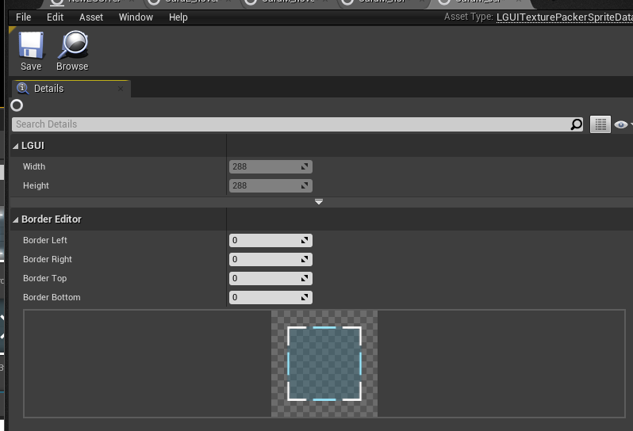

[English](./README_en.md)  
**这是LGUI插件的一个扩展插件，需要LGUI 2.13.1及以上版本.**  
此插件可以让LGUI导入TexturePacker的图集，并在LGUI里当作sprite data来用.  
### 在TexturePacker中按照下图设置：  
 
### 在UE4和LGUI中按照下面步骤：  
#### 1.  
右键点击ContentBrowser空白处，选择**LGUI TexturePacker Importer**来创建个导入数据.  
(注意：根据UE4加载插件的顺序，有时候*LGUI TexturePacker Importer*会出现在"LGUI"分栏里).  

#### 2.  
双击打开刚才创建的*LGUI TexturePacker Importer*，点击"Json File Path"后面的"..."按钮，选择*TexturePacker*导出的json文件.  

#### 3.  
点击"Create"按钮，选择一个文件夹来保存将要创建的**LGUITexturePackerSpriteData**.  

#### 4.  
双击创建的一个*LGUITexturePackerSpriteData*打开，可以在这里编辑border信息.  

