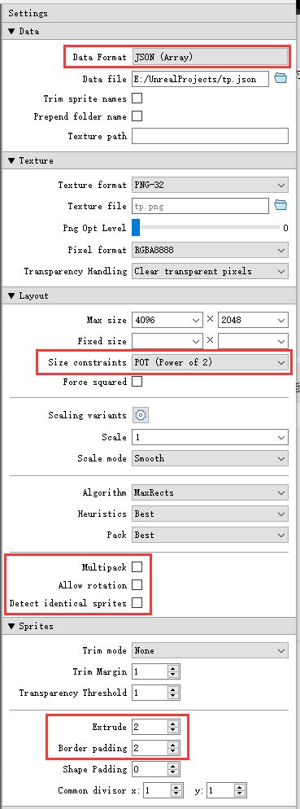
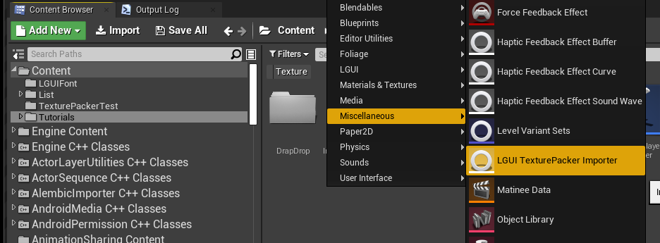
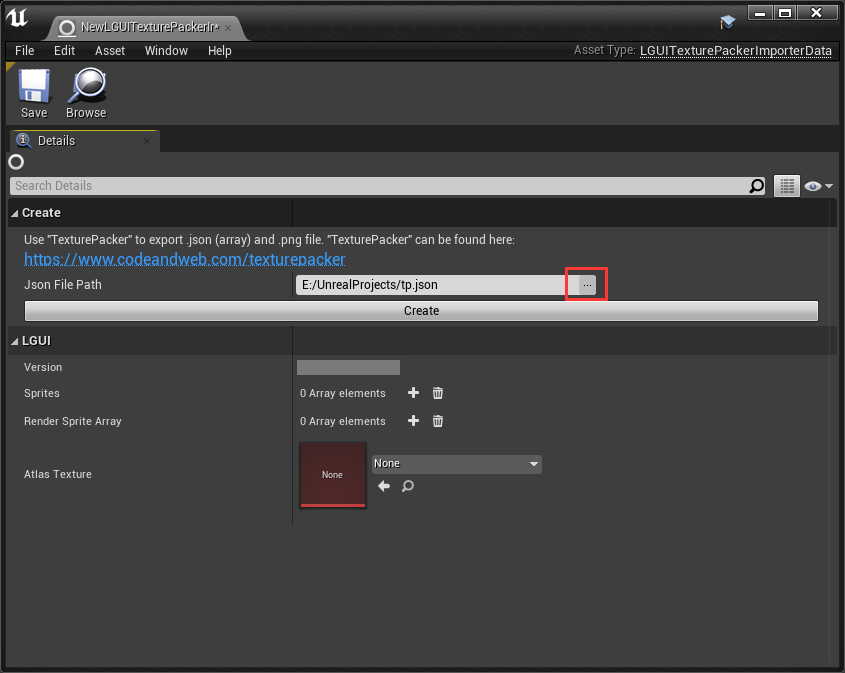
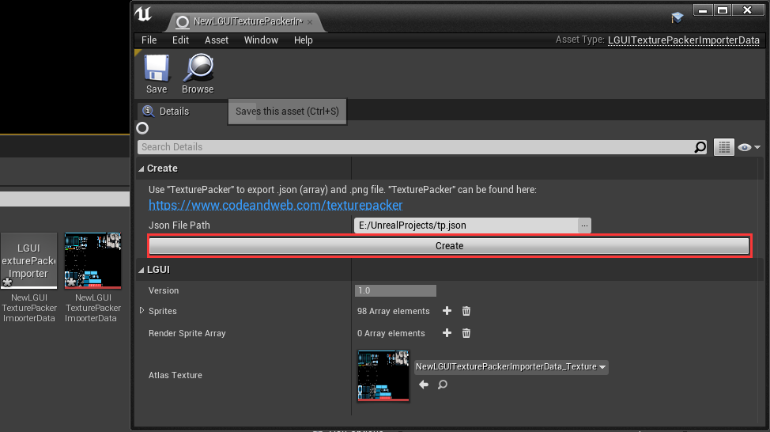
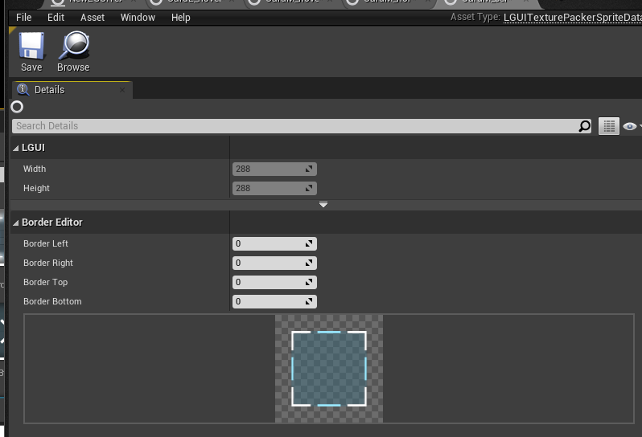

[中文](./README.md)  
**This is a LGUI's extension plugin, need LGUI version 2.13.1 and upward.**  
This plugin allows us to import [TexturePacker](https://www.codeandweb.com/texturepacker) as LGUI's sprite data.  
### For TexturePacker's settins, follow the image below:  
 
### In UE4 LGUI follow these steps:  
#### 1.  
Right click in ContentBrowser and select **LGUI TexturePacker Importer** to create a importer data.  
(Note: Sometimes the *LGUI TexturePacker Importer* may appear inside "LGUI" category or "Miscellaneous" category, depends on what order UE4 loads plugins).  

#### 2.  
Double click to open it, click the button "..." after the "Json File Path", then select a *TexturePacker* exported json file.  

#### 3.  
Click "Create" button and select a folder to store the generated **LGUITexturePackerSpriteData**.  

#### 4.  
Double click a *LGUITexturePackerSpriteData* to open it, so we can edit border info on it.  

